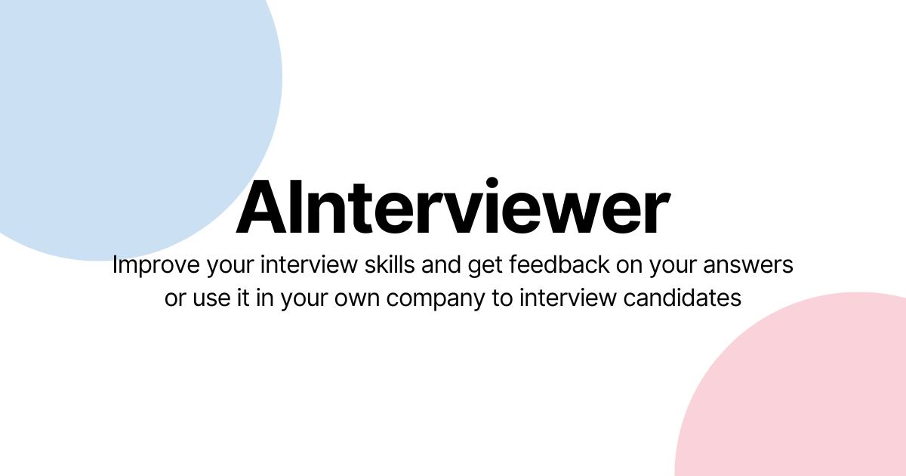

<div align=center>
    <h1 style="font-size: 48px; font-weight: bold">AInterviewer</h1>
    <p>Get or create interviews from an AI-powered and unbiased HR-like professional! Prepare for interviews or use it in your business.</p>
    
</div>

## Description

AInterviewer is a SaaS.

## Tech stack used

This is a bootstrapped application using [Create Next App](https://github.com/vercel/next.js) with TurboPack and [Bun](https://bun.sh) with the following features:

-   Styles with ShadCN/ui.
-   Authentication with Auth.js
-   Database provider with NeonDB and PostgreSQL.
-   ORM handled by DrizzleORM.
-   Linting and code style with Prettier and ESLint.

## How to run locally?

```bash
# Clone the repo

git clone https://github.com/pulgueta/OSS-Interviewer

# Install dependencies

cd OSS-Interviewer
bun install

# Add your .env file and replace the variables

cp .env.example .env

# Run your server locally

bun dev --turbo
```
